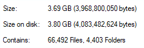

# CodeSurf

Personal codebase search tool, totally private.
It's a simple electron based UI to the great code search tool [The Silver Searcher aka ag](https://github.com/ggreer/the_silver_searcher).
Although I love using ag from command line, I seek to have a UI with some tangible navigation systems in between my codebase.

## Install

* Download CodeSurf's latest release from [releases page](https://github.com/hakanu/code_surf/releases).
* Install  Silver searcher from [its own docs](https://github.com/ggreer/the_silver_searcher/blob/master/README.md)

## Features

* Fast, really fast search (thanks to ag)
  * Whole linux kernel files (3.7GB) are searched in mere 12 seconds
  (with 10 letter search query) in my 
  machine which is probably not a good benchmark but I scan the spinning disk
  with i5 8th gen with 32GB memory.
  * Since it does regexp match, the length of search query is important.




* Keyboard first navigation
* Respects .gitignore and .hgignore files as ag does.
* Clean UI
* All private, no internet access is needed.
* Keyboard shortcuts to bring it to focus whenever needed (ctrl + shift + J)
* Small memory footprint


<iframe width="560" height="315" src="https://www.youtube.com/embed/bAuW-iKSVU0" frameborder="0" allow="accelerometer; autoplay; encrypted-media; gyroscope; picture-in-picture" allowfullscreen></iframe>

## Dev notes

Made this in some afternoon sitting so don't judge me:P Still learning electron.
The code is based on pure js + a little bit jquery + bootstrap4 styles and lots of rooms for improvements.

```shell
npm install

npm start
```

## Roadmap 

* ~~Un-render in show source code file.~~
* jump with ctrl + g in the show source code window. 
* Add support to different search backends like ripgrep, ack, grep etc.
* Make windows installer
* Maybe add some analytics.
* Add app to electronjs apps page.
* For large searches, app becomes blank, make it somehow more informative.
* Add filters to the search:
  * f:folder/foo/bar => Give directory name
    * Something better: fuzzy search for file names too.
  * lang:py => Search only python files
* Add ids and class names into constants.
* ~~Open from editor directly.~~
* ~~Add stats.~~
* ~~Check if binaries are installed, if not warn them.~~
* Show binary selection under the search bar.
* Show case sensitivity under the search bar.
* Add ignore patterns into settings to add into path-to-ignore.

## Better name or any other feedback?

Shoot it to hi[at]hakanu.com or open an issue.

## Contribute

Feel free to send a pull request.


